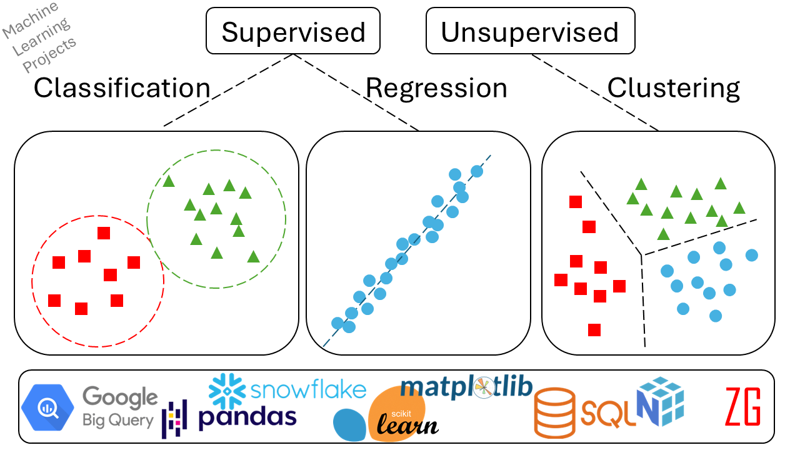

[> "Perfection is the enemy of good." — Voltaire](https://ziraddin-gulumjan.onrender.com/)

This repository focuses on implementing core **ML algorithms** from scratch. I prioritize clear, readable, and functional code over exhaustive hyperparameter tuning. The goal is to understand the *mechanics*, not just chase the last 0.1% of accuracy.

Also see:

[MLOps Projects](https://ziraddin-gulumjan.onrender.com/)

[Data Analytics, Data Science and Machine Learning Projects
](https://ziraddin-gulumjan.onrender.com/data-analytics/)

[Master Publications](https://ziraddin-gulumjan.onrender.com/papers/)
